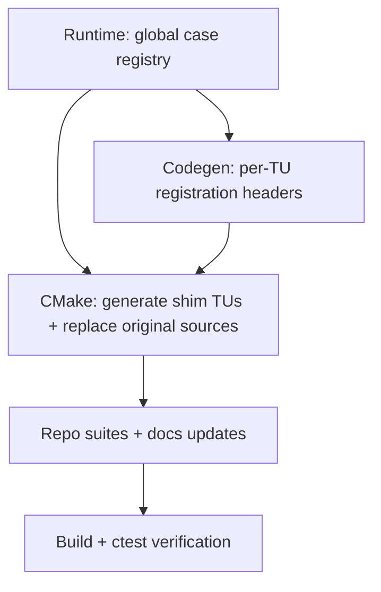

# Story: per-TU registration wrappers (CMake)

## Goal

Make gentest usage closer to gtest/catch/doctest by compiling tests as separate TUs (no single unity `test_impl.cpp` TU), while still using
attribute-driven discovery + generation.

## Design summary

The build uses **shim translation units** (a.k.a. “TU wrappers”) plus per‑TU registration headers:

- CMake generates shim TUs (`tu_####_*.gentest.cpp`) at configure time:
  - `#include`s the original `.cpp` so fixture types and test bodies are visible.
  - `#include`s the generated registration header (`tu_####_*.gentest.h`) **after** the original TU is visible.
  - The generated header include is guarded so codegen doesn’t require it to exist yet.
- `gentest_codegen` scans the shim TUs (so it gets compdb-aligned flags) and emits **only** the per‑TU registration headers into `OUTPUT_DIR`
  via `--tu-out-dir`.
- `gentest_attach_codegen()` replaces the target’s original `.cpp` sources with the generated shim TUs to avoid ODR violations (the shim includes
  the original `.cpp`).

Path hygiene:
- Shim `#include` directives use paths relative to the wrapper directory (avoids embedding absolute paths in generated sources).
- `gentest::Case.file` is normalized relative to `--source-root` so it is stable across machines/build dirs.

Multi-config:
- TU wrapper mode is intentionally not supported with multi-config generators (use manifest mode or separate build dirs).

## Diagram

## Acceptance criteria

- `ctest --preset=debug-system --output-on-failure` passes with per-TU mode enabled.
- Generated shims and headers compile even when a TU contains zero discovered cases.
